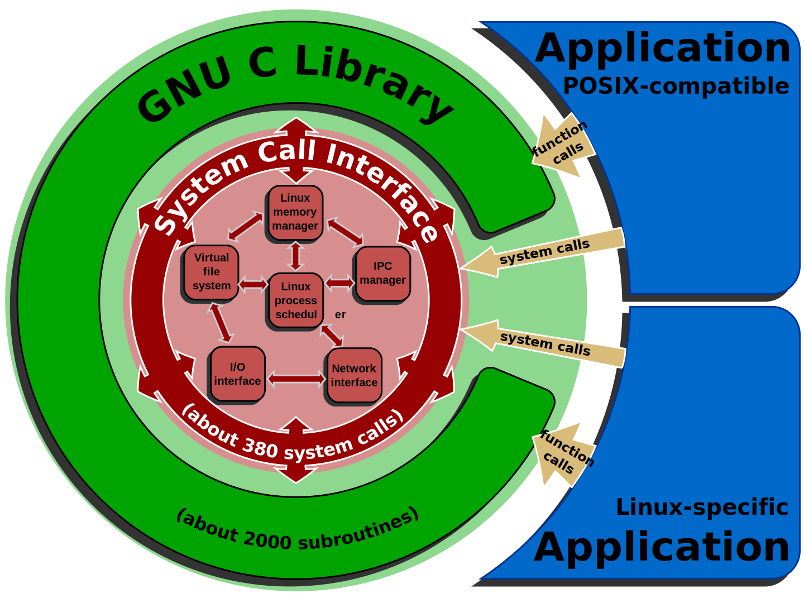

# SystemCall & Library 系统调用 和 库

开发user-space Program有两种方法，
* 调用库 function calls
* 调用内核 system calls  
不过库最终也是调用内核来实现其功能的。

我们在学习Linux上的应用程序(Application),或者说用户态程序(user-space Program)时，
主要学习的是常用内核函数和常用glibc(Gnu C Library)函数的使用方法。

## man-pages

[SystemCall](http://man7.org/linux/man-pages/dir_section_2.html)   
[Library](http://man7.org/linux/man-pages/dir_section_3.html)

## C Standard Library

After a long period of stability, three new header files (iso646.h, wchar.h, and wctype.h) 
were added with Normative Addendum 1 (NA1), an addition to the C Standard ratified in 1995. Six more header files 
(complex.h, fenv.h, inttypes.h, stdbool.h, stdint.h, and tgmath.h) were added with C99, a revision to the C Standard 
published in 1999, and five more files (stdalign.h, stdatomic.h, stdnoreturn.h, threads.h, and uchar.h) with C11 in 2011.
 In total, there are now 29 header files:

<assert.h>
<complex.h>
<ctype.h>
<errno.h>
<fenv.h>
<float.h>
<inttypes.h>
<iso646.h>
<limits.h>
<locale.h>
<math.h>
<setjmp.h>
<signal.h>
<stdalign.h>
<stdarg.h>
<stdatomic.h>
<stdbool.h>
<stddef.h>
<stdint.h>
<stdio.h>
<stdlib.h>
<stdnoreturn.h>
<string.h>
<tgmath.h>
<threads.h>
<time.h>
<uchar.h>
<wchar.h>
<wctype.h>

[wikipedia](https://en.wikipedia.org/wiki/C_standard_library)   

豆瓣上的图书，推荐给大家   
[The Standard C Library](https://book.douban.com/subject/1920997/)

## Gnu C Library

Gnu C Library 是由 [Richard Stallman](../Person/RichardStallman.md)创造的一个标准C库。
Gnu C Library 遵行 [Posix](https://liduanjun.coding.me/posix/) 规范，
同时也实现了 System V 上的特性和其它特性。它是一个混血儿。

### Gnu C Library Document
[Glibc-Document-PDF](resource/libc.pdf)

### Gnu C Library 和 Linux C Library关系

Gnu C Library 1 出来以后，Linux社区的开发者fork了它，改名为Linux C Library。
Gnu C Library 1 在 linux 上的文件为 /libs/libc.so.1
Linux C Library 经历了 2 3 4 5代，它在linux 上的文件为
* /libs/libc.so.2
* /libs/libc.so.3
* /libs/libc.so.4
* /libs/libc.so.5

后来Linux社区的开发者发现Gnu社区的开发者开发的Gnu C Library比他们自己的要好，于是，
Linux社区的开发者又把Linux上的默认C库换成了Gnu C Library。
于是 Gnu C Library 2在linux上顺延着叫 
* /libs/libc.so.6

由于Linux C Library中文件所属不详，而Gnu社区又比较在意这个版权问题，所以没有把
Linux C Library中的文件合并到Gnu C Library中去。

### Gnu 和 Linux关于Linux-header的争吵

曾几何时，Gnu社区和Linux社区争吵谁应该提供

## Posix

1980s-1990s , 世界上的unix变体操作系统太多，为了规范unix，The Open Group 在 IEEE 的基础上，
定义了Posix规范，Posix规范定义了操作系统与应用程序的接口。

这么多年来，这个规范在不断的更新，如果做系统的厂家都支持这个规范，那么我们编写的
C程序就可以在各种操作系统下编译运行了。

Windows NT 系列(xp,7,10)操作系统也是支持Posix规范的。

实现Posix规范的操作系统只能叫做unix-like操作系统，
只有实现并且只实现[Single Unix Specification](http://www.opengroup.org/onlinepubs/9699919799/)标准的才能叫做unix操作系统

只有被Open Group官方认证的操作系统才能正式地标注为unix操作系统。
linux 目前还没有被认证过，可能是因为linux发展太快，每改动一次代码就要认证一次，嫌麻烦吧。

### Posix Document
[Posix-Document-PDF](resource/n1570.pdf)

