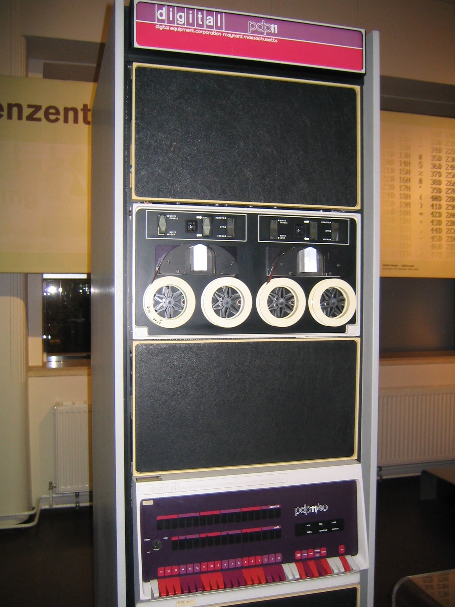
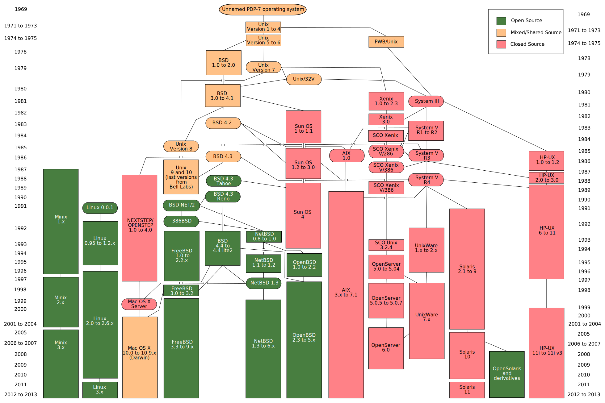

# unix

## 起源

1965年时，贝尔实验室（Bell Labs）加入一项由通用电气（General Electric）和麻省理工学院（MIT）合作
的计划；该计划要建立一套多使用者、多任务、多层次（multi－user、multi－processor、multi－level）
的MULTICS操作系统。直到1969年，因MULTICS计划的工作进度太慢，该计划被停了下来。当时，Ken Thompson
（后被称为UNIX之父）已经有一个称为"星际旅行"的程序在GE－635的机器上跑，但是反应非常慢，
正巧被他发现了一部被闲置的PDP－7（Digital的主机），Ken Thompson和Dernis Ritchie就将"星际旅行"
的程序移植到PDP－7上.

*PDP－7*

在1970年时，那部PDP－7却只能支持两个使用者，当时，Brian Kernighan就开玩笑地称他们的系统其实是:
"UNiplexed Information and Computing Service"，缩写为"UNICS"，后来，大家取其谐音，就称其为"UNIX"了。

*PDP－11*

1971年，Ken Thompson写了充分长篇的申请报告，申请到了一台PDP-11/24的机器。于是Unix第一版出来了。
在一台PDP-11/24的机器上完成。这台电脑只有24KB的物理内存和500K磁盘空间。Unix占用了12KB的内存，
剩下的一半内存可以支持两用户进行Space Travel的游戏。而著名的fork()系统调用也就是在这时出现的。  

到了1973年的时候，Ken Thompson 与Dennis Ritchie感到用汇编语言做移植太过于头痛，他们想用高级语言来完成第三版，
对于当时完全以汇编语言来开发程序的年代，他们的想法算是相当的疯狂。一开始他们想尝试用Fortran，可是失败了。
后来他们用一个叫BCPL（Basic Combined Programming Language）的语言开发，他们整合了BCPL形成B语言，
后来Dennis Ritchie觉得B语言还是不能满足要求，于是就改良了B语言，这就是今天的大名鼎鼎的[C语言](C.md)。于是，
Ken Thompson 与Dennis Ritchie成功地用C语言重写了Unix的第三版内核。至此，Unix这个操作系统修改、
移植相当便利，为Unix日后的普及打下了坚实的基础。而Unix和C完美地结合成为一个统一体，C与Unix很快成为世界的主导。

## unix 版权历史

Unix诞生于1969年，是贝尔实验室员工Ken Thompson的个人项目。由于贝尔实验室是AT&T（美国电话电报公司）的下属机构，
所以Unix的版权归AT&T所有。

AT&T垄断了美国长途电话业务，所以美国司法部在1958年与它签了一个和解协议。AT&T同意不进入计算机业，
不销售任何与计算机有关的产品，以避免司法部起诉它违反《反垄断法》。Unix是计算机的操作系统，所以AT&T不能销售它，
任何要求得到源码的机构，都能免费得到。
加州大学伯克利分校得到源码后，为Unix添加了许多功能。然后在1979年，推出了一个自家的Unix版本，
取名为Berkeley Software Distribution（伯克利软件套件），简称BSD。

正当Unix蓬勃发展之际，发生了一件谁也没有想到的事情。
1974年，美国司法部再次起诉AT&T违反《反垄断法》。1982年，哥伦比亚地区法庭判决AT&T败诉，
必须被拆成8家小公司。但是，这个判决也意味着1958年的和解协议失效，AT&T从此可以进入计算机业。
1983年，AT&T发布了Unix最新版system V，这是一个商业化版本，付费才能使用，并且不得传播源码。
这个决定对BSD构成了限制，为了减少纠纷，伯克利分校规定，BSD本身依然保持免费，但是只能提供给持有AT&T源码许可的公司。
不过，与此同时，伯克利的师生也开始着手另一项工作:将AT&T的专有代码从BSD中逐渐去除。
80年代后期，几个伯克利毕业的学生，成立了一家Berkeley Software Design Inc.公司，简称BSDi，
专门销售BSD的一个商业版本。他们在广告中宣称，自己的产品不包含任何AT&T代码。这句话惹恼了AT&T，1990年BSDi被告上法庭，
稍后伯克利分校也被追加为被告。AT&T起诉BSD侵犯了Unix的版权。
这场诉讼对BSD打击极大，所有的开发活动都被迫停止，用户人心惶惶，担心自己也遭到AT&T的追究，因此BSD的使用急剧减少。
这场战争给Unix和BSD带来毁灭性的打击,AT&T固执地捍卫Unix版权，完全不顾它的创造者和开发者的愿望，导致Unix丧失活力,
一蹶不振，大量开发者无法参与，只好离开了这个平台。

与此同时，Intel的80x86芯片有巨大的发展，性能快速上升，而成本快速下降，个人电脑的年代就要到来了。
市场迫切需要能够运行在intel 386芯片上的操作系统，但是Unix和BSD忙于打官司，都没有去做移植操作系统这件事。
其他两个这样做的人，改变了人类历史。
一个是比尔·盖茨，他推出了Windows，占领了个人电脑市场，后来赚了万亿美元，成为世界首富。
另一个是芬兰大学生Linus Torvalds，他想学习Unix，但是买不起工作站，就自己写了一个能在386上运行的Linux操作系统，
现在全世界超过一半的网络服务器都在使用这个系统。
官司结束以后，BSD发生了分裂，变成了FreeBSD、NetBSD和OpenBSD三个版本，但此时市场已经被widnwos和linux占领了。

## unix 版本历史与分支

