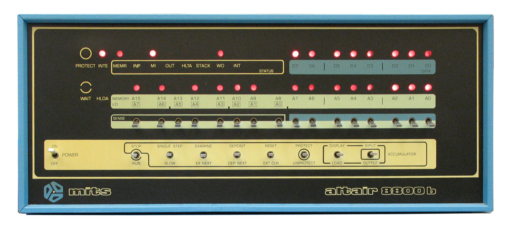

# ARM 基本知识

## 什么是寄存器(Register)

寄存器是处理器对外的接口，我们可以通过查看(read)寄存器，了解处理器的状态.
也可以通过(write)操控寄存器，改变处理器的状态。就好像我们可以通过操作飞机
上的控制面板上的按钮，手柄等来改变飞机的状态，通过查看飞机上的仪表来查看
飞机上各种设备的状态一样。

从是否可写给寄存器分类，可以得到三类寄存器
* 只读寄存器
* 只写寄存器
* 既可读，也可写寄存器

## 什么是指令(Instruction)

如果将寄存器们比作飞机上的控制面板上的各种按键、指示灯...
那么指令可以比作飞行员。
飞行员可以查看面板上仪表，来确定飞机的状态，然后大脑分析判断，
去手动操作那些按钮、旋钮、推杆来改变飞机的状态。
指令也是同样的，指令可以查看(read)寄存器的值来查看处理器的状态,
指令可以改变(write)寄存器的值来改变处理器的状态。
同时，指令也可以做各种运算(加、减、乘、除、与、或、非、与或、移位)，
这些运算就好像飞行员在进行大脑的分析判断。

微观地来看，程序是在不停地循环下列操作 ： 
查看处理器状态(读寄存器)->计算->改变处理器状态(写寄存器) 

## 名词解释

* RAZ:Read-As-Zero
* SBZP:Should-Be-Zero-or-Preserved
* FIQ:Fast Interrupt Request
* IRQ:Interrupt Request

## ARMv7 、Cortex-A9  、 Exynos 4412 、 FS4412 之间的关系

Cortex-A9 是 ARM 的一款处理器的型号，ARMv7 是 ARM 公司的处理器的一个架构。

ARMv7 是处理器架构的第七代，在此核心之上进行裁剪与定制，就形成了 ARM 公司三大处理器系列，
* Cortex-M
* Cortex-A
* Cortex-R 

当然这三大处理器系列中的产品不全是来自 ARMv7 核心，也来自 ARMv8 核心。

Cortex-A9 基于 ARMv7 核心，同一核心的处理器使用同样的指令集。
使用同一指令集的程序是 Binary compatibility (二进制兼容)的。

ARMv7好比 unix标准规范，Cortex-A9是这个标准的实现，就将linux内核一样。
三星把 Cortex-A9 拿去，加上自己的接口、多媒体编解码器等组成一个完整地处理器。
就像红帽把 Linux内核 拿去，加上自己的软件，组成一套自己的操作系统一样。

再打一个比方，比如重庆小面。重庆小面的原料，做法，面的宽细都有一个标准，
这个标准就类似于ARMv7,根据这个标准做出来的面就是Cortex-A9,
面馆老板把面煮熟了，加上酸菜，就成了酸菜面，可以提供给客户了。
就像 Exynos 4412 可以提供给 硬件工程师 使用了。

硬件工程师将 Exynos 4412 加入到自己的电路设计文件中，再加上一些外围电路，
就组成电路板了，电路板交给软件工程师写程序，软件工程师将写好程序的电路板
交给结构工程师，结构工程师给电路板设计外壳，最终成为一个完整地产品，比如手机。   
*实际上工程师们是并行工作的。*

总结：   
ARMv7->Cortex-A9->Exynos 4412->FS4412   
架构->核心->芯片->电路板