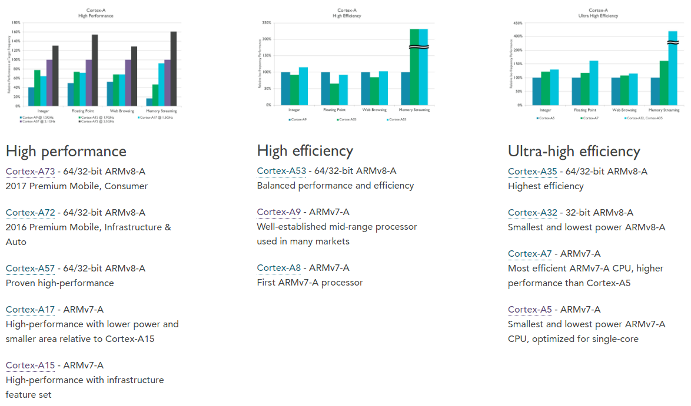
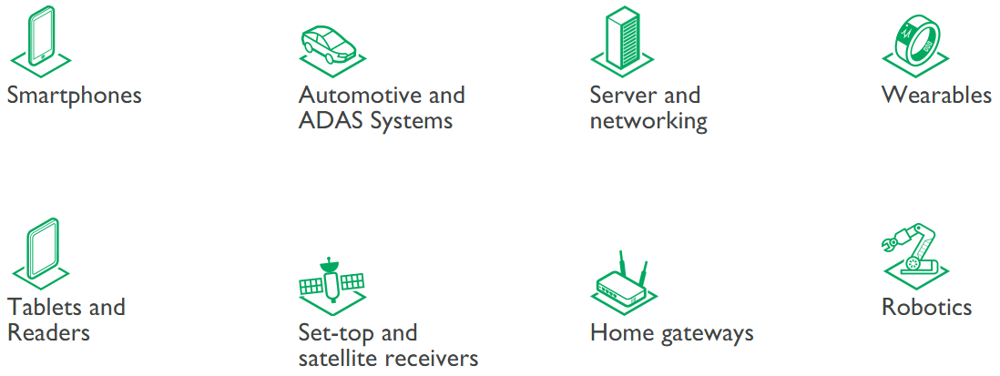

# Cortex-A 

## Cortex-A characteristics - Cortex-A 特性

所有Cortex-A处理器们都有相同的架构和特性。
使用ARMv7-A架构的Cortex-A处理器支持32bit的ARM指令和寻址，同时也支持16/32混合的Thumb指令。

ARMv8-A架构的Cortex-A处理器支持64bit的寻址和AArch64执行状态，同时也向后兼容AArch32执行状态。

Cortex-A 系列处理器有以下扩展架构
* ARM TrustZone®, to provide support for security 
* SIMD and Advanced SIMD (NEON) technologies 
* ARM Floating Point architecture (VFP)
* big.LITTLE technology
* Large Physical Address Extension (LPAE) addressing up to 1TB of physical memory on some of the 32-bit ARMv7-A processors.

## Multicore technology - 多核技术

* 从单核到4核具有硬件一致性
* 支持“对称多处理技术”和“非对称多处理技术”
* 通过Accelerator Coherency Port (ACP)技术，可以让外部无缓存总线主控器达到一致性
* 通过AMBA® 4 ACE(AMBA Coherency Extension) 和 AMBA 5 CHI(Coherent Hub Interface)，可以保证非同族间的CPU的使用也可以保持一致性。

## Industry standard - 行业标准

Cortex-A 处理器是行业标准，成功归功于ARM的合作伙伴。

## Cortex-A 的应用

