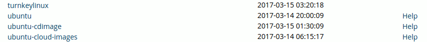
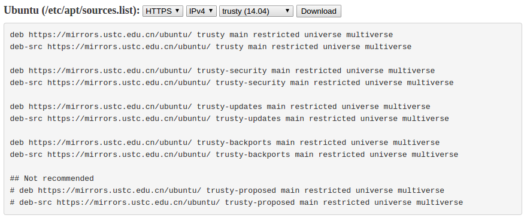

# 更新 ubuntu 14.04 软件源

1. 打开 source.list

```
sudo gedit /etc/apt/source.list
```

2. 浏览器打开 源网站

```
http://mirrors.ustc.edu.cn/
```

3. find source in "ustc"




snullp 大叔开发的 [配置生成器](https://mirrors.ustc.edu.cn/repogen/) 。



4. update

```
sudo apt-get update
```

##  minicom

1. 安装ubuntu上的串口调试助手 

```
sudo apt-get install minicom
```

2. minicom 设置

在设置 minicom 之前，要看 ttyUSB0 是否存在

```
ls /dev/ttyUSB0
```

如果存在，就继续设置

```
sudo minicom -s
```

3. 打开 minicom

```
sudo minicom
```

4. 使用 minicom

minicom 快捷键 Ctrl+A Z

## U-boot 使用提示

* 开机倒数前，按回车键可以进入 u-boot 命令行

* print - 打印所有 u-boot 的变量
	```
	baudrate=115200
	ethaddr=11:22:33:44:55:66
	ethact=dm9000
	gatewayip=192.168.1.1
	serverip=192.168.1.44
	ipaddr=192.168.1.33
	bootcmdbck=tftp 41000000 zImage;bootm 41000000
	bootdelay=2
	stdin=serial
	stdout=serial
	stderr=serial 
	```