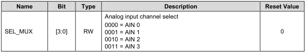
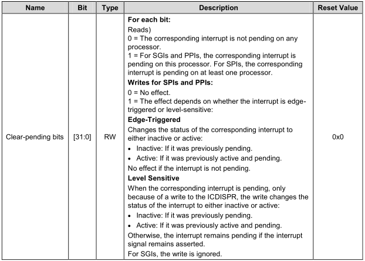
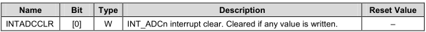
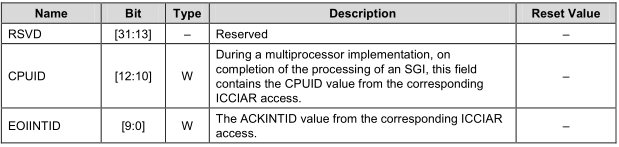

# ARM体系结构与接口技术 A/D转换中断

## 电路原理图之按键   


## AD中断初始化代码
```
ADC_CFG &= ~(0x1 << 16); //Bit_16:Select ADC Mux 0:General 1:MTCADC
ADCMUX = 0x3;	//0x3: 0011 = AIN3

/** GIC interrupt controller:**/
// Enables the corresponding interrupt SPI10
ICDISER.ICDISER1 |= 0x1 <<10;
CPU0.ICCICR |= 0x1; //Global enable for signaling of interrupts
CPU0.ICCPMR = 0xFF; //The priority mask level.Priority filter. threshold
/*
* Bit1:  GIC monitors the peripheral interrupt signals and
* forwards pending interrupts to the CPU interfaces2
*/
ICDDCR = 1; 
			

/***** Interrupt combiner*****/
INTCOMBINER.IESR2 |= 0x1 << 19;
//SPI8~11  interrupts are sent to processor 0
ICDIPTR.ICDIPTR10 = 0x01010101;	

//12bit A/D conversion; enable A/D converter prescaler; prescaler value:255
ADCCON = (0x1<<16) | (0x1<<14) | (0xff<<6);
```

ADC 相关的寄存器
```
/***********************  ADC ******************************************/
#define  	ADC_CFG		__REG(0x10010118)
#define		ADCCON		__REG(0x126C0000)
#define		ADCDLY		__REG(0x126C0008)
#define		ADCDAT		__REG(0x126C000C)
#define		CLRINTADC	__REG(0x126C0018)
#define		ADCMUX		__REG(0x126C001C)
```

* ADC_CFG
	* Base Address: 0x126C_0000
	* Address = Base Address + 0x0118, Reset Value = 0x0000_0000
	* 
* ADCMUX
	* Base Address: 0x126C_0000
	* Address = Base Address + 0x001C, Reset Value = 0x0000_0000
	* 
* ADCCON
	* Base Address: 0x126C_0000
	* Address = Base Address + 0x0000, Reset Value = 0x0000_3FC4
	* 


## AD中断处理代码
```
void do_irq(void )
{
	unsigned int  temp_adc = 0, temp_mv;

	int irq_num;
	irq_num = (CPU0.ICCIAR & 0x1FF);

	printf("IRQ interrupt !!\n");

	temp_adc = ADCDAT & 0xfff;

	printf("adcdat:  %0x\n", temp_adc);
	//temp_mv = 1800 * temp_adc / 4095;
	temp_mv = 1.8 * 1000 * temp_adc / 0xfff;

	printf("adc value: %d mv\n", temp_mv);

	//Clear SPI Pending
	ICDICPR.ICDICPR1 |= 0x1 << 10;
	//clear ADC pending
	INTADCCLR = 1;
	// End of interrupt
	CPU0.ICCEOIR = (CPU0.ICCEOIR & ~(0x1FF)) | irq_num;

}
```
* ICCIAR_CPU0
	* Base Address: 0x1048_0000
	* Address = Base Address + 0x000C, Reset Value = 0x0000_03FF
	* 
* ADCDAT
	* Base Address: 0x126C_0000
	* Address = Base Address + 0x000C, Reset Value = 0x0000_00FF
	* 
* ICDICPR1
	* Base Address: 0x1049_0000
	* Address = Base Address + 0x0284, Reset Value = 0x0000_0000
	* 
* INTADCCLR
	* Base Address: 0x126C_0000
	* Address = Base Address + 0x0018, Reset Value = Undefined
	* 
* ICCEOIR_CPU0
	* Base Address: 0x1048_0000
	* Address = Base Address + 0x0010, Reset Value = Undefined
	* 