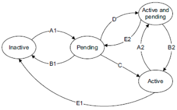
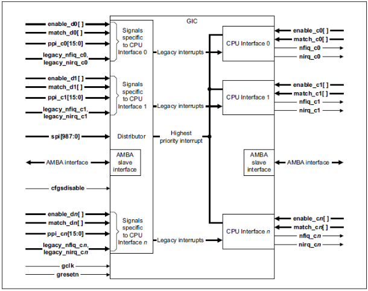
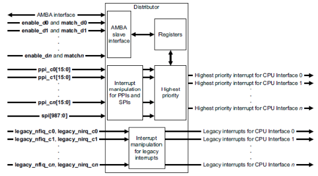
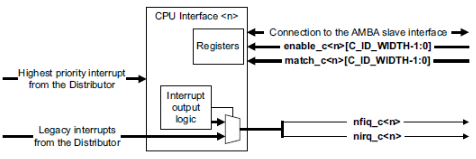

# GIC - Generic Interrupt Controller 通用中断控制器

## GIC 的作用

* 管理中断源
* 控制中断行为
* 将中断信号路由至多个处理器

当GIC具有安全扩展时，它可以接收FIQ - Fast Interrupt Request

## GIC 的特性

* 支持三种类型的中断
	* SGI - Software Generated Interrupt
	* PPI - Private Peripheral Interrupt
	* SPI - Share Peripheral Interrupt
* 通过编程来配置中断
	* 中断的安全状态
	* 中断的优先级
	* 可用或禁用中断
	* 处理器接收中断
* 中断的状态
	* Inactive
	* Pending
	* Active
	* Active and Pending
	* 
* 中断的分发
	* 1-N : 适合 SPI - Share Peripheral Interrupt
	* N-N : 适合 SGI - Software-Generated Interrupt
* 模式组
	* 多组中断
	* 多组寄存器

## GIC Block

## Distributor Block

## CPU interface

