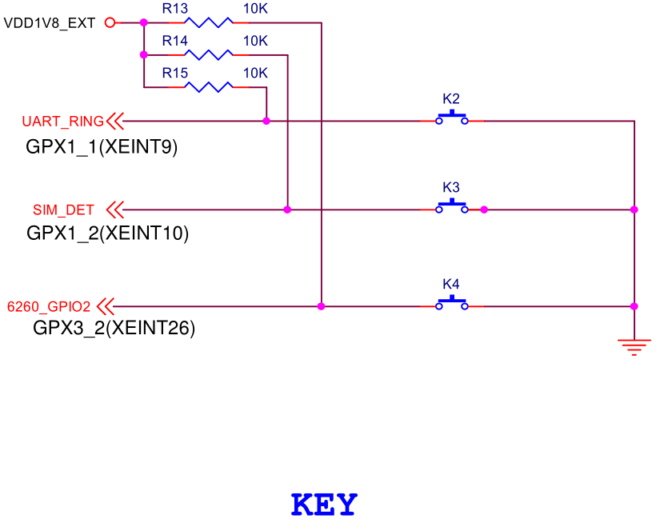
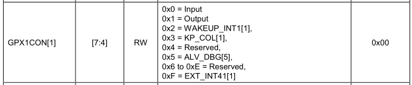
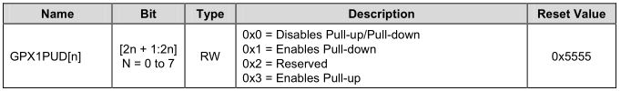
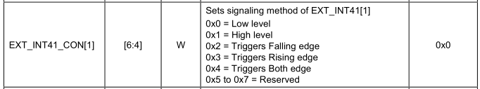
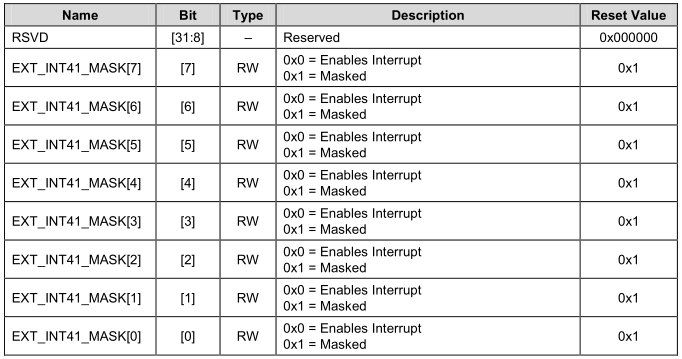
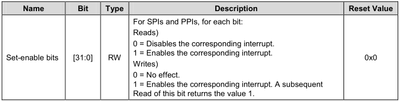
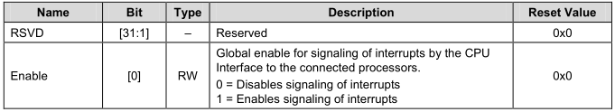
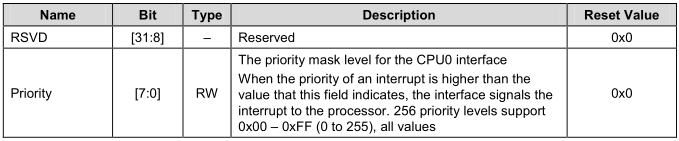
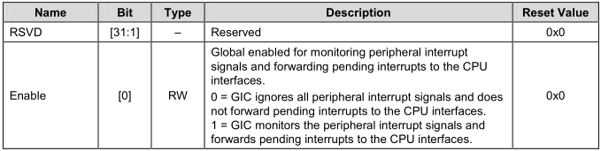
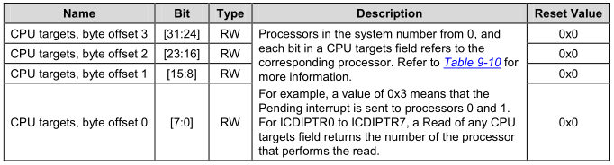

# ARM体系结构与接口技术 按键中断

## 电路原理图之按键   


## 按键中断的核心代码-GPIO设置 
```
//Key_2  Interrupt  GPX1_1
GPX1.GPX1PUD = GPX1.GPX1PUD & ~(0x3 << 2); // Disables Pull-up/Pull-down
GPX1.GPX1CON = (GPX1.GPX1CON & ~(0xF << 4)) | (0xF << 4); //GPX1_1: WAKEUP_INT1[1](EXT_INT41[1])
EXT_INT41_CON = (EXT_INT41_CON & ~(0x7 << 4)) | 0x2 << 4;
EXT_INT41_MASK = (EXT_INT41_MASK & ~(0x1 << 1)); //  Bit: 1 = Enables interrupt
```

GPX1 相关的寄存器
```
/* GPX1 */
typedef struct {
				unsigned int GPX1CON;
				unsigned int GPX1DAT;
				unsigned int GPX1PUD;
				unsigned int GPX1DRV;
}gpx1;
#define GPX1 (* (volatile gpx1 *)0x11000C20 )
```

* GPX1CON
	* Base Address: 0x1100_0000
	* Address = Base Address + 0x0C20, Reset Value = 0x0000_0000
	* 
* GPX1PUD
	* Base Address: 0x1100_0000
	* Address = Base Address + 0x0C28, Reset Value = 0x5555
	* 
* EXT_INT41_CON
	* Base Address: 0x1100_0000
	* Address = Base Address + 0x0E04, Reset Value = 0x0000_0000
	* 
* EXT_INT41_MASK
	* Base Address: 0x1100_0000
	* Address = Base Address + 0x0F04, Reset Value = 0x0000_00FF
	* 

## 按键中断的核心代码-GIC设置
```
/*
	 * GIC interrupt controller:
	 * */

	// Enables the corresponding interrupt SPI25, SPI26 -- Key_2, Key_3
	ICDISER.ICDISER1 |= (0x1 << 25) | (0x1 << 26);

	CPU0.ICCICR |= 0x1; //Global enable for signaling of interrupts

	CPU0.ICCPMR = 0xFF; //The priority mask level.Priority filter. threshold

	ICDDCR = 1; 	//Bit1:  GIC monitors the peripheral interrupt signals and
					//		forwards pending interrupts to the CPU interfaces2

	ICDIPTR.ICDIPTR14 = 0x01010101;	//SPI25  SPI26  interrupts are sent to processor 0
```

* ICDISER.ICDISER1
	* Base Address: 0x1049_0000
	* Address = Base Address + 0x0104, Reset Value = 0x0000_0000 (ICDISER1_CPU0)
	* 
* CPU0.ICCICR
	* Base Address: 0x1048_0000
	* Address = Base Address + 0x0000, Reset Value = 0x0000_0000 (ICCICR_CPU0)
	* 
* CPU0.ICCPMR
	* Base Address: 0x1048_0000
	* Address = Base Address + 0x0004, Reset Value = 0x0000_0000 (ICCPMR_CPU0)
	* 
* ICDDCR
	* Base Address: 0x1049_0000
	* Address = Base Address + 0x0000, Reset Value = 0x0000_0000
	* 
* ICDIPTR.ICDIPTR14
	* Base Address: 0x1049_0000
	* Address = Base Address + 0x0838, Reset Value = 0x0000_0000 (ICDIPTR14_CPU0)
	* 