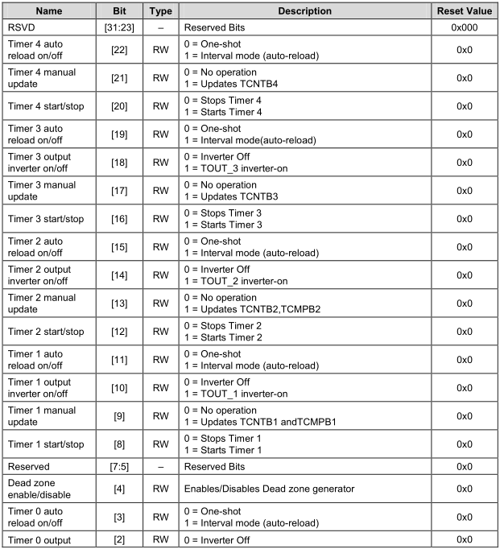

# PWM - Pulse Width Modulation 脉宽调制

## 蜂鸣器相关寄存器
```
/********************************** PWM ********************************/

typedef struct {
				unsigned int	TCFG0;
				unsigned int	TCFG1;
				unsigned int	TCON;
				unsigned int	TCNTB0;
				unsigned int	TCMPB0;
				unsigned int	TCNTO0;
				unsigned int	TCNTB1;
				unsigned int	TCMPB1;
				unsigned int	TCNTO1;
				unsigned int	TCNTB2;
				unsigned int	TCMPB2;
				unsigned int	TCNTO2;
				unsigned int	TCNTB3;
				unsigned int	TCMPB3;
				unsigned int	TCNTO3;
				unsigned int	TCNTB4;
				unsigned int	TCNTO4;
				unsigned int	TINT_CSTAT;
}pwm;
#define		PWM (* (volatile pwm *)0x139D0000)
```

## 蜂鸣器代码

```
void PWM_init(void)
{
	GPD0.CON = (GPD0.CON & ~(0xf)) | 0x2;// GPD0_0 : TOUT_0

	PWM.TCFG0 = (PWM.TCFG0 & ~(0xFF)) |0x63; //Prescaler 0 value for timer 0; 99 + 1 = 100
	PWM.TCFG1 = (PWM.TCFG1 & ~(0xF)) | 0x3; // 1/8 input for PWM timer 0

	PWM.TCNTB0 = 200;
	PWM.TCMPB0 = 100;

	/* auto-reload, Inverter Off, manual update */
	PWM.TCON = (PWM.TCON & ~(0XF)) | 0XA;
	/* auto-reload, Inverter Off, manual update off, start Timer0*/
	PWM.TCON = (PWM.TCON & ~(0xF)) | 0X9;

}
```
* GPD0CON
	* Base Address: 0x1140_0000
	* Address = Base Address + 0x00A0, Reset Value = 0x0000_0000
	* 
* TCFG0
	* Base Address: 0x139D_0000
	* Address = Base Address + 0x0000, Reset Value = 0x0000_0101
	* 
* TCFG1
	* Base Address: 0x139D_0000
	* Address = Base Address + 0x0004, Reset Value = 0x0000_0000
	* 
* TCNTB0
	* Base Address: 0x139D_0000
	* Address = Base Address + 0x000C, Reset Value = 0x0000_0000
	* 
* TCMPB0
	* Base Address: 0x139D_0000
	* Address = Base Address + 0x0010, Reset Value = 0x0000_0000
	* 
* TCON
	* Base Address: 0x139D_0000
	* Address = Base Address + 0x0008, Reset Value = 0x0000_0000
	* 