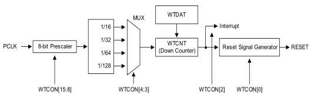

# WDT - Watch Dog Timer 

## WDT Block



## WDT 寄存器

```
/*
*WATCHDOG TIMER
*/
typedef struct {
				unsigned int WTCON  ;
				unsigned int WTDAT  ;
				unsigned int WTCNT  ;
				unsigned int WTCLRINT  ;

}wdt;
#define  WDT (* (volatile wdt *)0xEA200000 )
```

## WTD 代码

```
void wdt_init()
{
	WDT.WTCNT = 0x2014;	//initial value

	/*
	*Prescaler value:255,  Enables WDT
	*Prescaler clock division factor 128
	*Enables WDT reset signal
	*/
	WDT.WTCON = 0xff<<8 | 1<<5 | 3<<3 | 1;
}

int main(void)
{
	wdt_init();
	while(1)
	{
		#if 0
			// Feed Dog
			WDT.WTCNT = 0x2014;
		#endif
	}
	return 0;
}
```

* WTCON
	* Base Address: 0x1006_000
	* Address = Base Address + 0x0000, Reset Value = 0x0000_8021
	* 