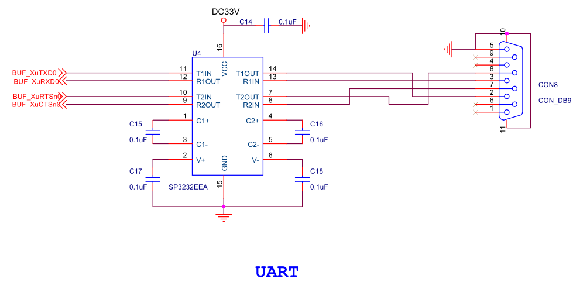
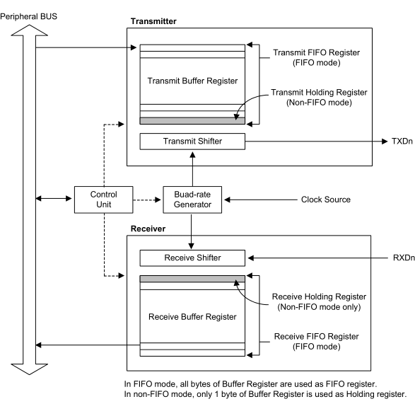
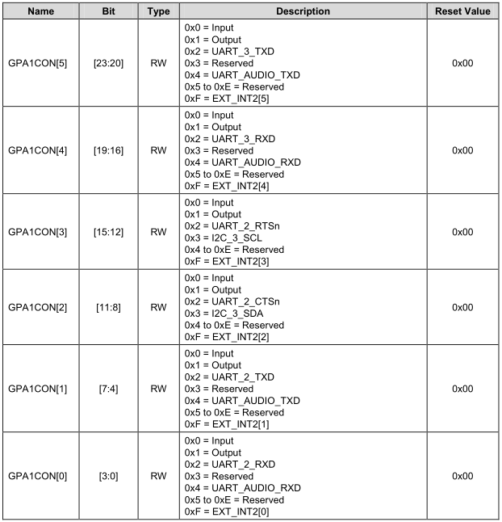
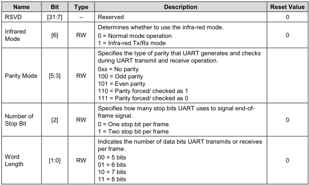
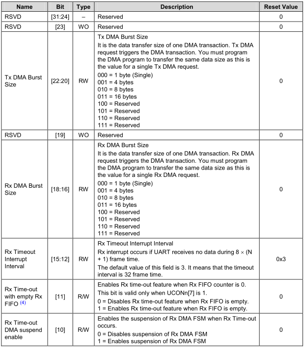
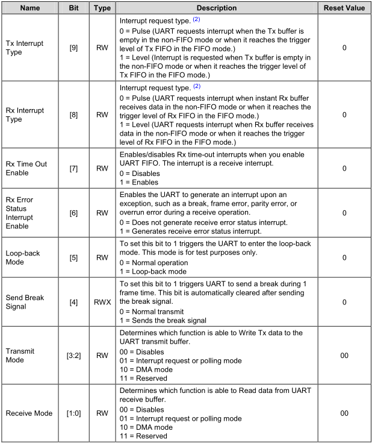
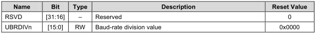
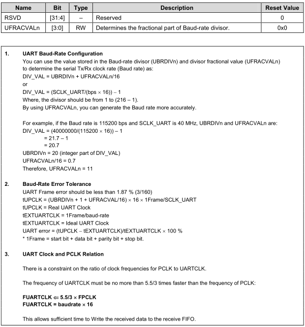

# UART - Universal Asynchronous Receiver and Transmitter 通用异步收发传输器，俗称串口

## UART 原理图



## UART Block



## UART 寄存器

```
/*
 * UART2
 */
typedef struct {
				unsigned int ULCON2;
				unsigned int UCON2;
				unsigned int UFCON2;
				unsigned int UMCON2;
				unsigned int UTRSTAT2;
				unsigned int UERSTAT2;
				unsigned int UFSTAT2;
				unsigned int UMSTAT2;
				unsigned int UTXH2;
				unsigned int URXH2;
				unsigned int UBRDIV2;
				unsigned int UFRACVAL2;
				unsigned int UINTP2;
				unsigned int UINTSP2;
				unsigned int UINTM2;
}uart2;
#define UART2 ( * (volatile uart2 *)0x13820000 )
```

## UART 代码

```
void uart_init(void)
{

	/*UART2 initialize*/
	GPA1.GPA1CON = (GPA1.GPA1CON & ~0xFF ) | (0x22); //GPA1_0:RX;GPA1_1:TX

	UART2.ULCON2 = 0x3; //Normal mode, No parity,One stop bit,8 data bits
	UART2.UCON2 = 0x5;  //Interrupt request or polling mode


	/*
	 * Baud-rate 115200: src_clock:100Mhz
	 * DIV_VAL = (100*10^6 / (115200*16) -1) = (54.3 - 1) = 53.3
	 * UBRDIV2 = (Integer part of 53.3) = 53 = 0x35
	 * UFRACVAL2 = 0.3*16 = 0x5
	 * */
	UART2.UBRDIV2 = 0x35;
	UART2.UFRACVAL2 = 0x5;
}
```
* GPA1CON
	* Base Address: 0x1140_0000
	* Address = Base Address + 0x0020, Reset Value = 0x0000_0000
	* 
* ULCON2
	* Base Address: 0x1382_0000
	* Address = Base Address + 0x0000, Reset Value = 0x0000_0000
	* 
* UCON2
	* Base Address: 0x1382_0000
	* Address = Base Address + 0x0004, Reset Value = 0x0000_0000
	* 
	* 
* UBRDIV2
	* Base Address: 0x1382_0000
	* Address = Base Address + 0x0028, Reset Value = 0x0000_0000
	* 
* UFRACVAL2
	* Base Address: 0x1382_0000
	* Address = Base Address + 0x002C, Reset Value = 0x0000_0000
	* 