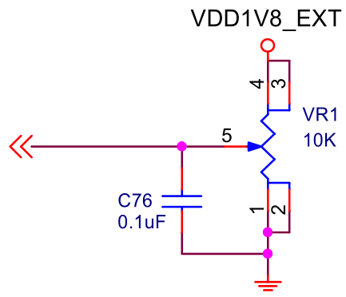
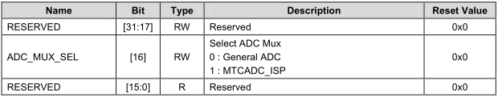
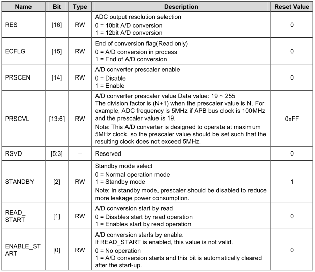
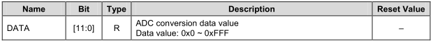

# ARM体系结构与接口技术 A/D转换

## 电路原理图之按键   


## 按键中断的核心代码-GPIO设置 
```
ADC_CFG &= ~(0x1 << 16); //Bit_16:Select ADC Mux 0:General 1:MTCADC
ADCMUX = 0x3;	//0x3: 0011 = AIN3
//12bit A/D conversion; enable A/D converter prescaler; prescaler value:255
ADCCON = (0x1<<16) | (0x1<<14) | (0xff<<6);
while(1)
{
	while(!(ADCCON & (0x1<<15)));
	temp_adc = ADCDAT & 0xfff;
	temp_mv = 1800 * temp_adc / 4095;
	printf("adc value: %d mv\n", temp_mv);
}
```

ADC 相关的寄存器
```
/***********************  ADC ******************************************/
#define  	ADC_CFG		__REG(0x10010118)
#define		ADCCON		__REG(0x126C0000)
#define		ADCDLY		__REG(0x126C0008)
#define		ADCDAT		__REG(0x126C000C)
#define		CLRINTADC	__REG(0x126C0018)
#define		ADCMUX		__REG(0x126C001C)
```

* ADC_CFG
	* Base Address: 0x126C_0000
	* Address = Base Address + 0x0118, Reset Value = 0x0000_0000
	* 
* ADCMUX
	* Base Address: 0x126C_0000
	* Address = Base Address + 0x001C, Reset Value = 0x0000_0000
	* 
* ADCCON
	* Base Address: 0x126C_0000
	* Address = Base Address + 0x0000, Reset Value = 0x0000_3FC4
	* 
* ADCDAT
	* Base Address: 0x126C_0000
	* Address = Base Address + 0x000C, Reset Value = 0x0000_00FF
	* 
