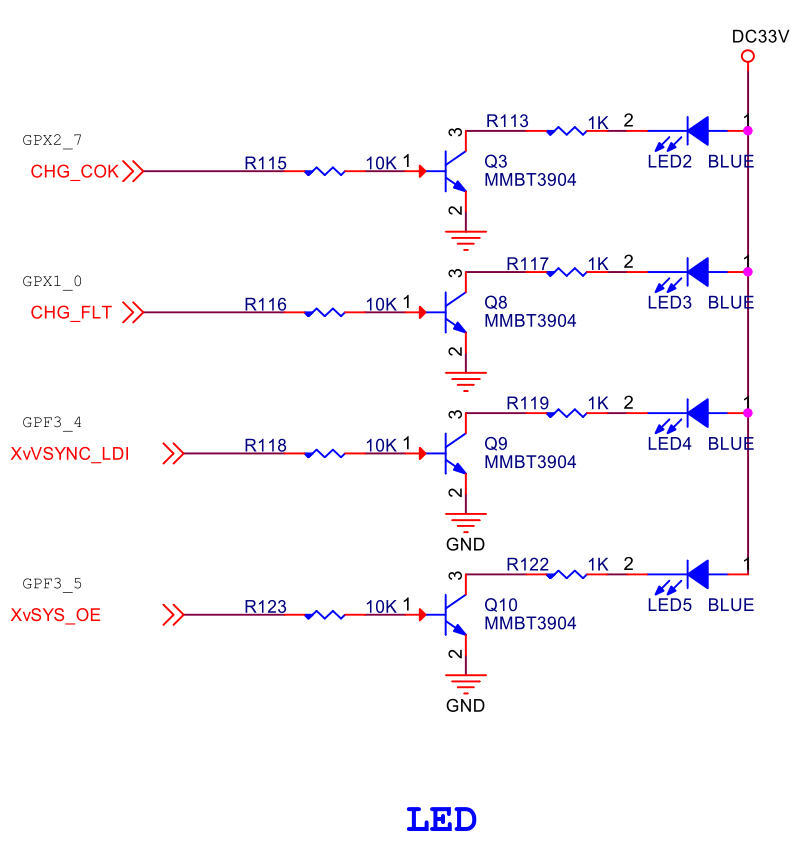
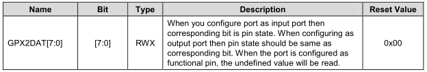

# ARM体系结构与接口技术 流水灯

## 电路原理图之流水灯  


## 按键中断的核心代码-LED
```
//LED 2_7
GPX2.CON = (GPX2.CON & ~(0xf<<28))| 1<<28;//GPX2_7:output, LED2
GPX2.DAT |= 0x1 << 7;
```
* GPX2CON
	* Base Address: 0x1100_0000
	* Address = Base Address + 0x0C40, Reset Value = 0x0000_0000
	* 
* GPX2DAT
	* Base Address: 0x1100_0000
	* Address = Base Address + 0x0C44, Reset Value = 0x0000_0000
	* 