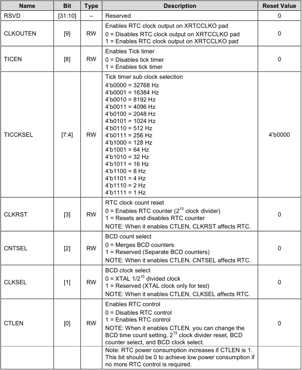
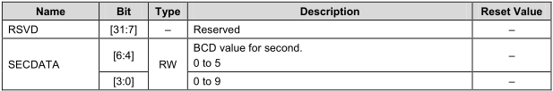
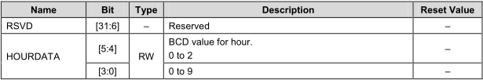
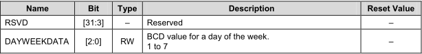
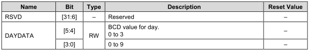
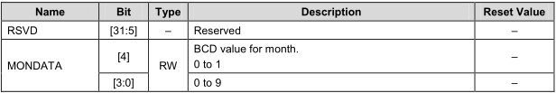
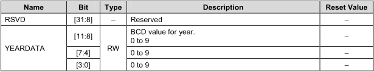

# RTC - Realtime Clock 实时时钟

## RTC 相关寄存器
```
/**RTC independ register**/
#define		RTCINTP			__REG(0X10070030)
#define		RTCCON			__REG(0X10070040)
#define		TICCNT			__REG(0X10070044)
#define		CURTICCNT		__REG(0X10070090)

typedef struct {
				unsigned int RTCALM;
				unsigned int SEC;
				unsigned int MIN;
				unsigned int HOUR;
				unsigned int DAY;
				unsigned int MON;
				unsigned int YEAR;
}rtclam;
#define		RTCALM (* (volatile rtclam *)0X10070050)


typedef	struct {

				unsigned int BCDSEC;
				unsigned int BCDMIN;
				unsigned int BCDHOUR;
				unsigned int BCDWEEK;
				unsigned int BCDDAY;
				unsigned int BCDMON;
				unsigned int BCDYEAR;
}rtcbcd;
#define 	RTC (* (volatile rtcbcd *)0X10070070)
```

## RTC 相关代码
```
void RTC_init()
{
	RTCCON = 0x1;	// Enables RTC control

	RTC.BCDSEC = 0x11;
	RTC.BCDMIN = 0x11;
	RTC.BCDHOUR = 0x11;
	RTC.BCDWEEK = 0x11;
	RTC.BCDDAY = 0x11;
	RTC.BCDMON = 0x11;
	RTC.BCDYEAR = 0x11;

	RTCCON = 0x0;	// Disables RTC control
}
```
* RTCCON
	* Base Address: 0x1007_0000
	* Address = Base Address + 0x0040, Reset Value = 0x0000_0000
	* 
* BCDSEC
	* Base Address: 0x1007_0000
	* Address = Base Address + 0x0070, Reset Value = Undefined
	* 
* BCDMIN
	* Base Address: 0x1007_0000
	* Address = Base Address + 0x0074, Reset Value = Undefined
	* 
* BCDHOUR
	* Base Address: 0x1007_0000
	* Address = Base Address + 0x0078, Reset Value = Undefined
	* 
* BCDWEEK
	* Base Address: 0x1007_0000
	* Address = Base Address + 0x007C, Reset Value = Undefined
	* 
* BCDDAY
	* Base Address: 0x1007_0000
	* Address = Base Address + 0x0080, Reset Value = Undefined
	* 
* BCDMON
	* Base Address: 0x1007_0000
	* Address = Base Address + 0x0084, Reset Value = Undefined
	* 
* BCDYEAR
	* Base Address: 0x1007_0000
	* Address = Base Address + 0x0088, Reset Value = Undefined
	* 