# I2C - Inter－Integrated Circuit

## 支持 I2C 总线的传感器之一 : 三轴加速度传感器

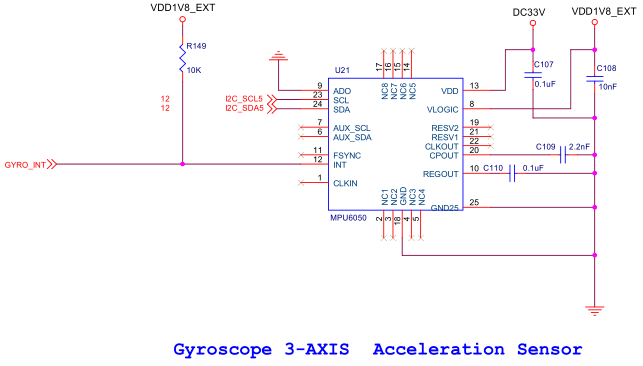
[三轴传感器MPU6050芯片手册](resource/MPU6050.pdf)

## I2C Block

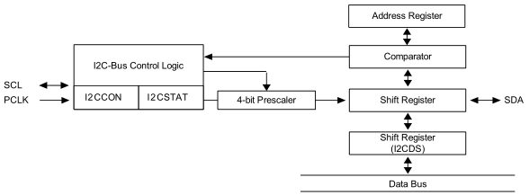

## I2C 协议

I2C 协议参考资料 : 
[飞利浦半导体I2C协议说明手册](resource/I2C_SPEC.pdf)

### I2C 启动停止条件

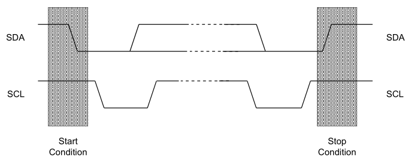

### I2C 数据格式

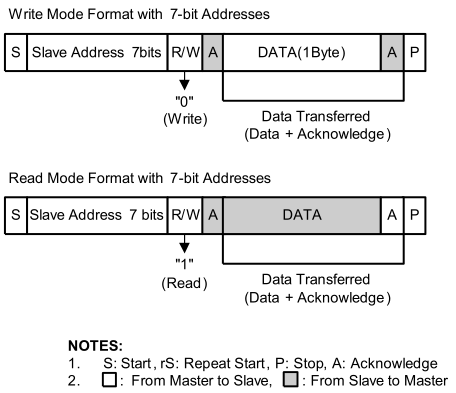

### I2C 数据传送时序图

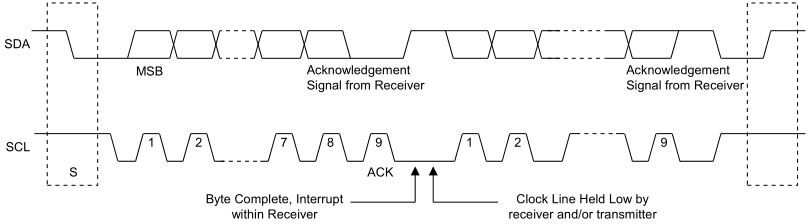

## I2C Master Transmitter Mode Flow Chart

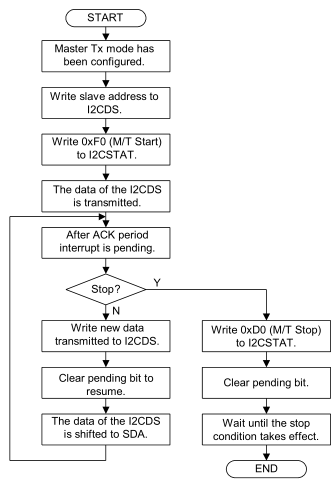

## I2C Master Receiver Mode Flow Chart

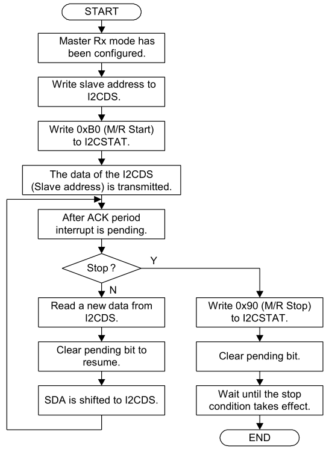

## I2C 寄存器

```
/*
*I2C5 REGISTERS
*/
typedef struct {
				unsigned int I2CCON;
				unsigned int I2CSTAT;
				unsigned int I2CADD;
				unsigned int I2CDS;
				unsigned int I2CLC;
}i2c5;
#define  I2C5 (* (volatile i2c5 *)0x138B0000 )
```

* I2CCON
	* Base Address: 0x138C_0000
	* Address = Base Address + 0x0000, Reset Value = 0x0000_0000
	* 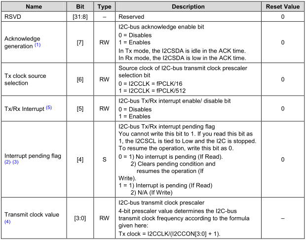
* I2CSTAT
	* Base Address: 0x138C_0000
	* Address = Base Address + 0x0004, Reset Value = 0x0000_0000
	* 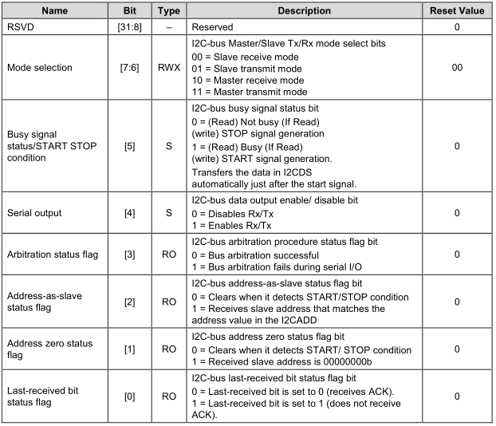
* I2CADD
	* Base Address: 0x138C_0000
	* Address = Base Address + 0x0008, Reset Value = 0x0000_0000
	* 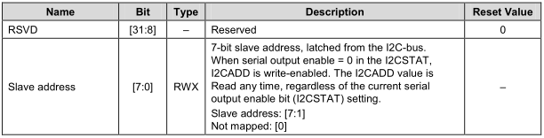
* I2CDS
	* Base Address: 0x138C_0000
	* Address = Base Address + 0x000C, Reset Value = 0x0000_0000
	* 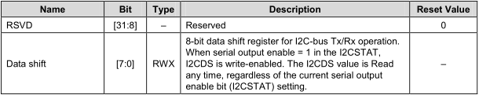
* I2CLC
	* Base Address: 0x138C_0000
	* Address = Base Address + 0x0010, Reset Value = 0x0000_0000
	* 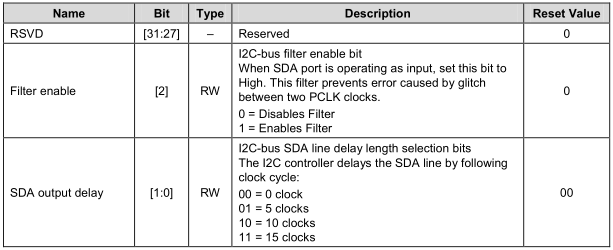

## I2C 代码

```
//****************************************
//	MPU6050内部地址
//****************************************
#define	SMPLRT_DIV		0x19	//陀螺仪采样率，典型值：0x07(125Hz)
#define	CONFIG			0x1A	//低通滤波频率，典型值：0x06(5Hz)
#define	GYRO_CONFIG		0x1B	//陀螺仪自检及测量范围，典型值：0x18(不自检，2000deg/s)
#define	ACCEL_CONFIG	0x1C	//加速计自检、测量范围及高通滤波频率，典型值：0x01(不自检，2G，5Hz)
#define	ACCEL_XOUT_H	0x3B
#define	ACCEL_XOUT_L	0x3C
#define	ACCEL_YOUT_H	0x3D
#define	ACCEL_YOUT_L	0x3E
#define	ACCEL_ZOUT_H	0x3F
#define	ACCEL_ZOUT_L	0x40
#define	TEMP_OUT_H		0x41
#define	TEMP_OUT_L		0x42
#define	GYRO_XOUT_H		0x43
#define	GYRO_XOUT_L		0x44
#define	GYRO_YOUT_H		0x45
#define	GYRO_YOUT_L		0x46
#define	GYRO_ZOUT_H		0x47
#define	GYRO_ZOUT_L		0x48
#define	PWR_MGMT_1		0x6B	//电源管理，典型值：0x00(正常启用)
#define	WHO_AM_I		0x75	//IIC地址寄存器(默认数值0x68，只读)
#define	SlaveAddress	0xD0	//IIC写入时的地址字节数据，+1为读取
```

```
/**********************************************************************
 * @brief		iic write a byte program body
 * @param[in]	slave_addr, addr, data
 * @return 		None
 **********************************************************************/
void iic_write (unsigned char slave_addr, unsigned char addr, unsigned char data)
{
	I2C5.I2CDS = slave_addr;
	I2C5.I2CCON = 1<<7 | 1<<6 | 1<<5;/*ENABLE ACK BIT, PRESCALER:512, ,ENABLE RX/TX */
	I2C5.I2CSTAT = 0x3 << 6 | 1<<5 | 1<<4;/*Master Trans mode ,START ,ENABLE RX/TX ,*/
	while(!(I2C5.I2CCON & (1<<4)));

	I2C5.I2CDS = addr;
	I2C5.I2CCON &= ~(1<<4);	//Clear pending bit to resume.
	while(!(I2C5.I2CCON & (1<<4)));

	I2C5.I2CDS = data;	// Data
	I2C5.I2CCON &= ~(1<<4);	//Clear pending bit to resume.
	while(!(I2C5.I2CCON & (1<<4)));

	I2C5.I2CSTAT = 0xD0; //stop

	I2C5.I2CCON &= ~(1<<4);

	mydelay_ms(10);
}
```

```
/**********************************************************************
 * @brief		iic read a byte program body
 * @param[in]	slave_addr, addr, &data
 * @return 		None
 **********************************************************************/
void iic_read(unsigned char slave_addr, unsigned char addr, unsigned char *data)
{
	I2C5.I2CDS = slave_addr;

	I2C5.I2CCON = 1<<7 | 1<<6 | 1<<5;/*ENABLE ACK BIT, PRESCALER:512, ,ENABLE RX/TX */
	I2C5.I2CSTAT = 0x3 << 6 | 1<<5 | 1<<4;/*Master Trans mode ,START ,ENABLE RX/TX ,*/
	while(!(I2C5.I2CCON & (1<<4)));

	I2C5.I2CDS = addr;
	I2C5.I2CCON &= ~(1<<4);	//Clear pending bit to resume.
	while(!(I2C5.I2CCON & (1<<4)));
	I2C5.I2CSTAT = 0xD0; //stop


	I2C5.I2CDS = slave_addr | 0x01;	// Read
	I2C5.I2CCON = 1<<7 | 1<<6 | 1<<5;/*ENABLE ACK BIT, PRESCALER:512, ,ENABLE RX/TX */

	I2C5.I2CSTAT = 2<<6 | 1<<5 | 1<<4;/*Master receive mode ,START ,ENABLE RX/TX ,*/
	while(!(I2C5.I2CCON & (1<<4)));

	I2C5.I2CCON &= ~((1<<7) | (1<<4));/* Resume the operation  & no ack*/
	while(!(I2C5.I2CCON & (1<<4)));

	I2C5.I2CSTAT = 0x90;
	I2C5.I2CCON &= ~(1<<4);		/*clean interrupt pending bit  */

	*data = I2C5.I2CDS;
	mydelay_ms(10);
}
```

```
/**********************************************************************
 * @brief		MPU6050_Init program body
 * @param[in]	None
 * @return 		None
 **********************************************************************/
void MPU6050_Init ()
{
	iic_write(SlaveAddress, PWR_MGMT_1, 0x00);
	iic_write(SlaveAddress, SMPLRT_DIV, 0x07);
	iic_write(SlaveAddress, CONFIG, 0x06);
	iic_write(SlaveAddress, GYRO_CONFIG, 0x18);
	iic_write(SlaveAddress, ACCEL_CONFIG, 0x01);
}
```

```
/**********************************************************************
 * @brief		get MPU6050 data program body
 * @param[in]	addr
 * @return 		int
 **********************************************************************/
int get_data(unsigned char addr)
{
	char data_h, data_l;
	iic_read(SlaveAddress, addr, &data_h);
	iic_read(SlaveAddress, addr+1, &data_l);
	return (data_h<<8)|data_l;
}
```

```
int main(void)
{
	
	GPX2.CON = 0x1 << 28;

	GPB.CON = (GPB.CON & ~(0xF<<12)) | 0x3<<12; // GPBCON[3], I2C_5_SCL
	GPB.CON = (GPB.CON & ~(0xF<<8)) | 0x3<<8;	// GPBCON[2], I2C_5_SDA

/*---------------------------------------------------------------------*/
	I2C5.I2CSTAT = 0xD0;
	I2C5.I2CCON &= ~(1<<4);		/*clean interrupt pending bit  */
/*---------------------------------------------------------------------*/

	MPU6050_Init();
}
```
* GPX2CON
	* Base Address: 0x1100_0000
	* Address = Base Address + 0x0C40, Reset Value = 0x0000_0000
	* 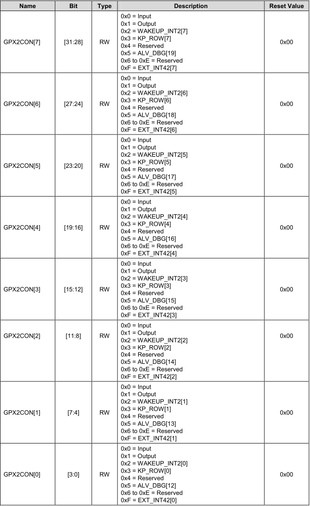
* GPBCON
	* Base Address: 0x1140_0000
	* Address = Base Address + 0x0040, Reset Value = 0x0000_0000
	* 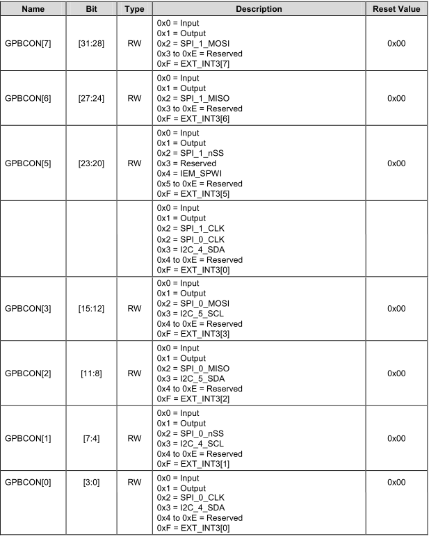
