# SPI - Serial Peripheral Interface

## 支持 SPI 总线的传感器之一 : CAN控制器

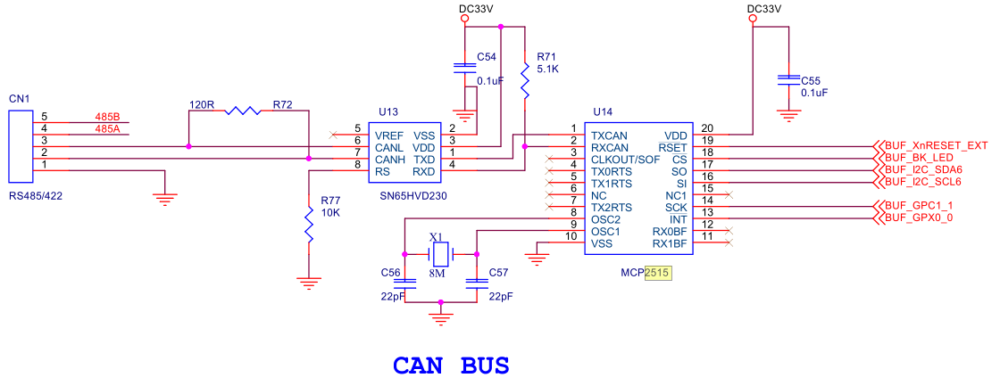
[CAN控制器mcp2515芯片手册](resource/mcp2515.pdf)

## SPI Transfer Format

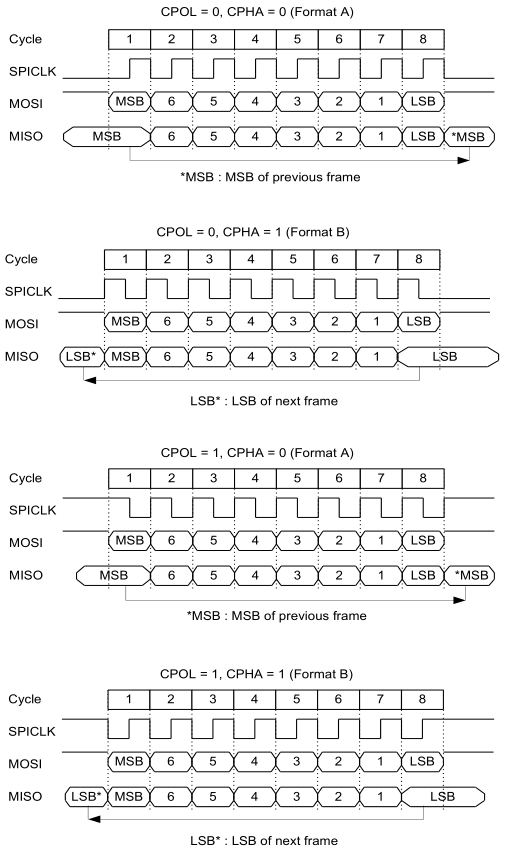

## SPI 时钟框图

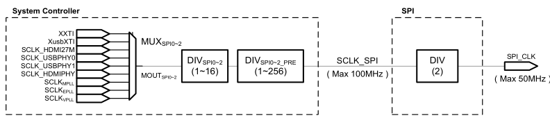

## SPI寄存器

```
/*
*SPI2 REGISTERS
*/
typedef struct {
				unsigned int CH_CFG     ;
				unsigned int RESERVED; // 4412's SPI has no CLK_CFG register
				unsigned int MODE_CFG   ;
				unsigned int CS_REG     ;
				unsigned int SPI_INT_EN ;
				unsigned int SPI_STATUS ;
				unsigned int SPI_TX_DATA;
				unsigned int SPI_RX_DATA;
				unsigned int PACKET_CNT_REG ;
				unsigned int PENDING_CLR_REG ;
				unsigned int SWAP_CFG   ;
				unsigned int FB_CLK_SEL ;
}spi2;
#define  SPI2 (* (volatile spi2 *)0x13940000 )
```
* CH_CFG
	* Base Address: 0x13940000
	* Address = Base Address + 0x0000, Reset Value = 0x0000_0000
	* 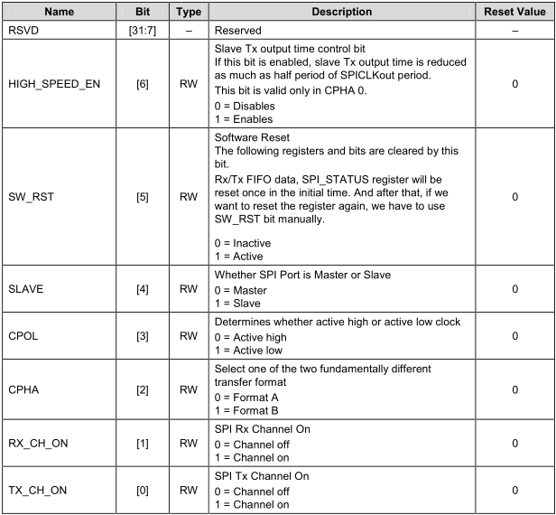
* MODE_CFG
	* Base Address: 0x13940000
	* Address = Base Address + 0x0008, Reset Value = 0x0000_0000
	* 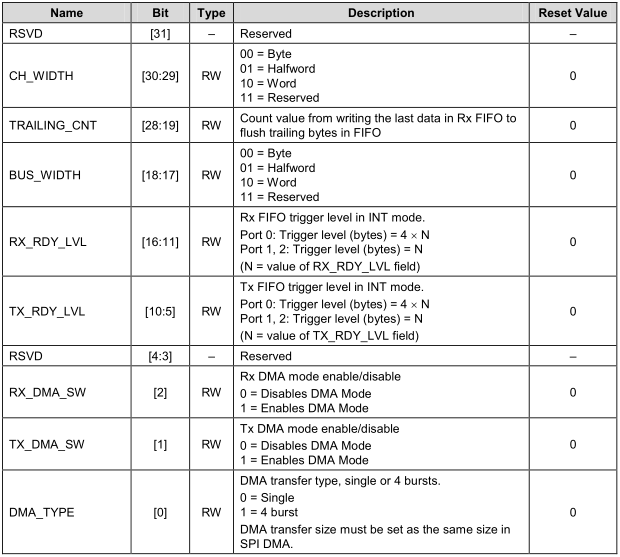
* CS_REG
	* Base Address: 0x13940000
	* Address = Base Address + 0x000C, Reset Value = 0x0000_0000
	* 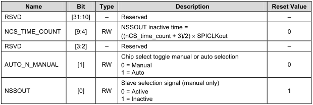
	* 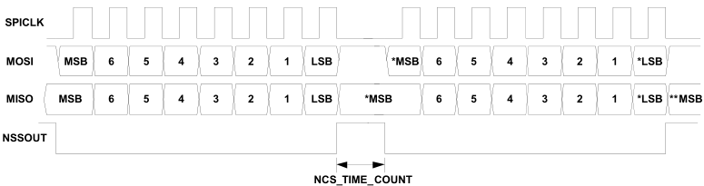
* SPI_INT_EN
	* Base Address: 0x13940000
	* Address = Base Address + 0x0010, Reset Value = 0x0000_0000
	* 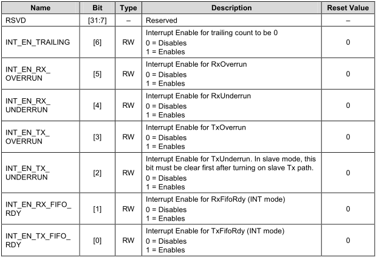
* SPI_STATUS
	* Base Address: 0x13940000
	* Address = Base Address + 0x0014, Reset Value = 0x0000_0000
	* 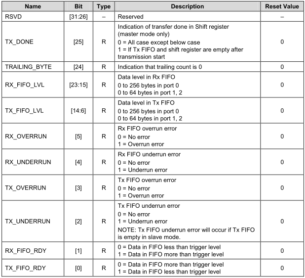
* SPI_TX_DATA
	* Base Address: 0x13940000
	* Address = Base Address + 0x0018, Reset Value = 0x0000_0000
	* 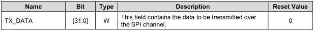
* SPI_RX_DATA
	* Base Address: 0x13940000
	* Address = Base Address + 0x0014, Reset Value = 0x0000_0000
	* 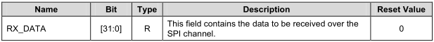
* PACKET_CNT_REG
	* Base Address: 0x13940000
	* Address = Base Address + 0xC254, Reset Value = 0x0000_0000
	* 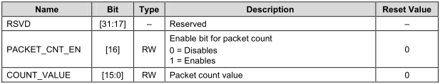
* PENDING_CLR_REG
	* Base Address: 0x13940000
	* Address = Base Address + 0x001C, Reset Value = 0x0000_0000
	* 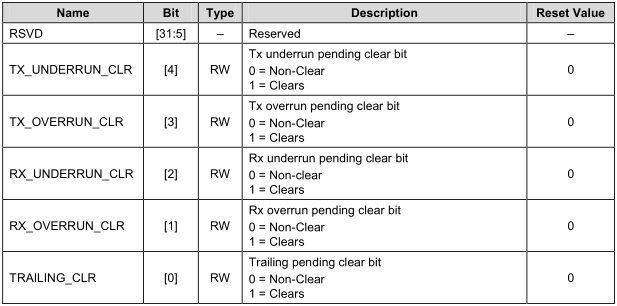
* SWAP_CFG
	* Base Address: 0x13940000
	* Address = Base Address + 0x0020, Reset Value = 0x0000_0000
	* 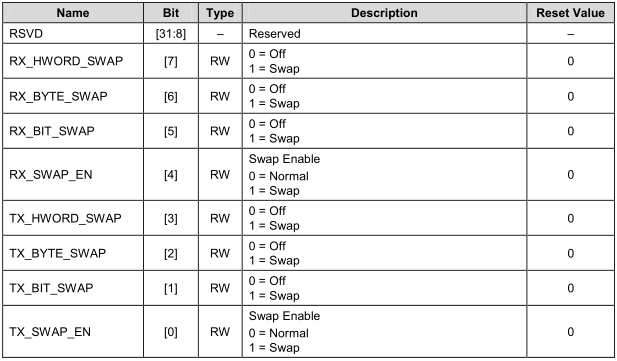
* FB_CLK_SEL
	* Base Address: 0x13940000
	* Address = Base Address + 0x0024, Reset Value = 0x0000_0000
	* 

## SPI 代码

```
int main(void)
{
	GPX2.CON = 0x1 << 28;
	uart_init();

	unsigned char ID[4],buff[8];            					//状态字
	unsigned char key;
	unsigned char ret;//,j,k,ret0,ret1,ret2,ret3,ret4,ret5,ret6,ret7,ret8,ret9;
	unsigned int rx_counter;
	volatile int i=0;

	GPC1.CON = (GPC1.CON & ~0xffff0) | 0x55550;//设置IO引脚为SPI模式

/*spi clock config*/
	CLK_SRC_PERIL1 = (CLK_SRC_PERIL1 & ~(0xF<<24)) | 6<<24;// 0x6: 0110 = SCLKMPLL_USER_T 800Mhz
	CLK_DIV_PERIL2 = 19 <<8 | 3;//SPI_CLK = 800/(19+1)/(3+1)

	soft_reset();	                   // 软复位SPI控制器
	SPI2.CH_CFG &= ~( (0x1 << 4) | (0x1 << 3) | (0x1 << 2) | 0x3);//master mode, CPOL = 0, CPHA = 0 (Format A)
	SPI2.MODE_CFG &= ~((0x3 << 17) | (0x3 << 29));   //BUS_WIDTH=8bit,CH_WIDTH=8bit
	SPI2.CS_REG &= ~(0x1 << 1);        //选择手动选择芯片
	mydelay_ms(10);    //延时
    Init_can();   //初始化MCP2515

    printf("\n************ SPI CAN test!! ************\n");

    while(1)
    {
		//Turn on
		GPX2.DAT = GPX2.DAT | 0x1 << 7;
		mydelay_ms(50);

    	printf("\nplease input 8 bytes\n");

    	for(i=0;i<8;i++)
    	{
    		src[i] = getchar();
    		putc(src[i]);
    	}
    	printf("\n");

    	Can_send(src); //发送标准帧
        mydelay_ms(100);
        ret = Can_receive(dst); //接收CAN总线数据
        printf("ret=%x\n",ret);
        printf("src=");
        for(i=0;i<8;i++) printf(" %x", src[i]);//将CAN总线上收到的数据发到串行口

        printf("\n");

        printf("dst=");
        for(i=0;i<8;i++) printf(" %x",dst[6+i]); //将CAN总线上收到的数据发到串行口
		printf("\n");

		//Turn off
		GPX2.DAT = GPX2.DAT & ~(0x1 << 7);
		mydelay_ms(100);
    } //while(1)

	return 0;
}
```
* CLK_SRC_PERIL1
	* Base Address: 0x1003_0000
	* Address = Base Address + 0xC254, Reset Value = 0x0000_0000
	* 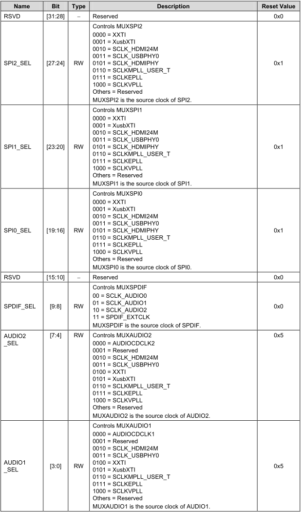
* CLK_DIV_PERIL2
	* Base Address: 0x1003_0000
	* Address = Base Address + 0xC558, Reset Value = 0x0000_0000
	* 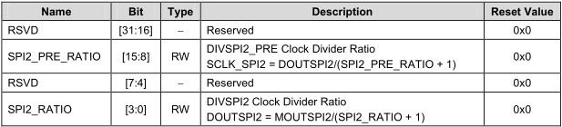